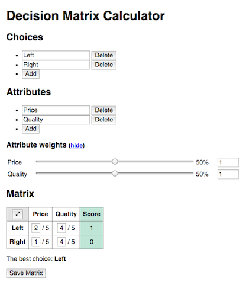

# Decision Matrix Calculator

A web app to help people make decisions, written in Angular.js.

I am writing this because I want to enable people to use decision matrices easily, without having to set up a spreadsheet or open a separate app like Excel. Writing this also helps me learn the client-side JavaScript framework I am writing it in – Angular in this case.

## Status

You can [view the current version](https://roryokane.github.io/decision-matrix-calculator-angular/) on GitHub Pages.

Still in development. You can edit the list of choices and attributes, and edit the relative weights of attributes, but you can’t yet edit the matrix of ratings and have the best choice calculated for you.

My next step is making the matrix of ratings be drawn dynamically, responding to changes in the lists of choices and attributes.

## How to run it

* Run `npm install` to install modules
* Run `make serve` to start a server that automatically compiles files

I can run `make deploy` to deploy this to my GitHub `gh-pages` branch.
